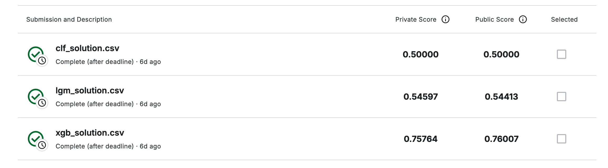

# Santander Customer Transaction Prediction

At Santander, the goal is to help people and businesses prosper. This project is aimed at predicting which customers will make a specific transaction in the future, regardless of the transaction amount. Using real-world data provided by Santander, this project tackles a binary classification problem.

## Project Overview

The challenge presented by Santander was to identify which customers would make a specific transaction. The dataset was highly imbalanced, as is often the case in real-world scenarios. Several machine learning models were employed to address this issue, focusing on algorithms that either naturally handle class imbalance or were adjusted using techniques such as the `class_weight` parameter.

## Streamlit Application

You can interact with our trained model using a [Streamlit application hosted on Huggingface](https://huggingface.co/spaces/zafermbilen/santander-customer-transaction-prediction).

### How to Use the Streamlit App:

1. **Upload a CSV file**: The app allows you to upload a CSV file with customer data.
2. **Prediction**: After uploading the file, the app will predict whether each customer will make a transaction or not.
   - **Positive Prediction**: "This customer is likely to make a transaction."
   - **Negative Prediction**: "This customer is not likely to make a transaction."
3. **Download Results**: You can download the predictions as a CSV file.

Visit the app here:  
👉 [Santander Customer Transaction Prediction App](https://huggingface.co/spaces/zafermbilen/santander-customer-transaction-prediction)

## Key Steps and Approaches

1. **Understanding Data Imbalance**:

   - The target variable in the dataset was imbalanced, with far fewer positive examples than negative ones.
   - This was visualized using graphs, and a strategy was defined to combat this imbalance.

2. **Algorithms Used**:

   - **XGBoost (XGBClassifier)**: This model is robust and handles imbalanced data well without much tuning.
   - **LightGBM (LGBMClassifier)**: Known for its speed and efficiency, this model was tested as a gradient boosting method.
   - **RandomForest (RandomForestClassifier)**: Used with the `class_weight='balanced'` parameter to handle class imbalance effectively.

3. **Model Performance**:

   - Various models were compared based on their performance on both public and private leaderboard scores. The `xgb_solution.csv` provided the best results with a private score of **0.75764** and a public score of **0.76007**.

   

4. **Challenges**:
   - **Class Imbalance**: Special techniques and models were chosen to mitigate the effects of imbalance.
   - **Model Tuning**: Each algorithm required some level of tuning to maximize performance on this specific dataset.

## Results

- **XGBoost** was the top-performing model, followed by **LGBMClassifier**. The **RandomForestClassifier** performed modestly but did not exceed expectations despite balancing attempts.

## Conclusion

The project successfully implemented machine learning models to predict customer transactions, overcoming challenges related to class imbalance. The work illustrates how different algorithms handle imbalanced data and how certain techniques can help boost prediction accuracy in such cases.

## Future Improvements

- **Data Augmentation**: Exploring synthetic data generation techniques like SMOTE to address class imbalance more effectively.
- **Hyperparameter Tuning**: Further fine-tuning models like XGBoost and LightGBM could yield even better results.
- **Ensemble Methods**: Combining predictions from multiple models to create a more robust final prediction.
